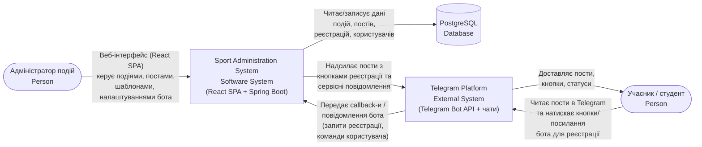
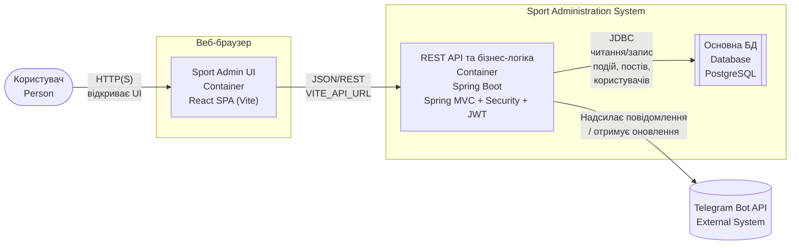
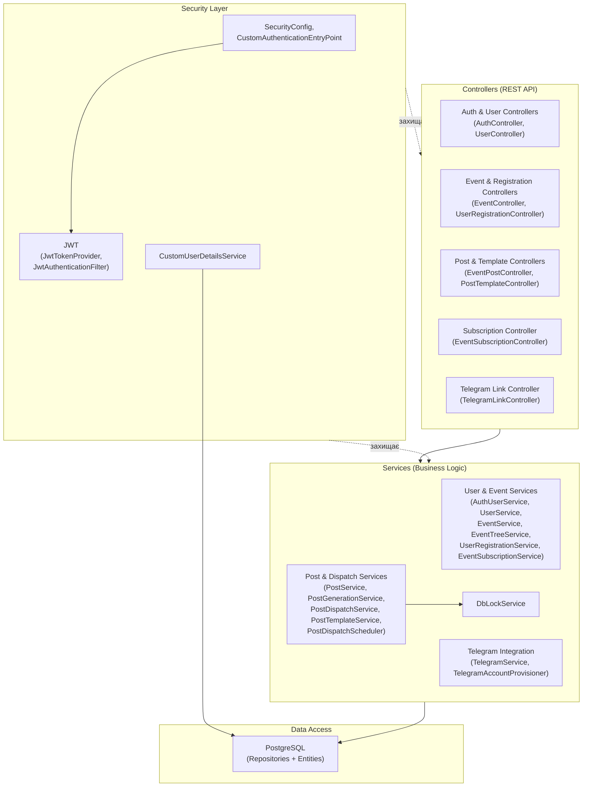

# Архітектура: Sport Administration System

Цей документ описує архітектуру системи за рівнями C4

---

## 1. C4 – System Context



---

## 2. C4 – Container diagram



---

## 3. C4 – Component diagram: Backend

### Опис

Бекенд побудований на **Spring Boot** та поділений на кілька основних шарів:  
**Controllers → Services → Security → Data**.

#### Controllers (REST API шар)

Відповідають за прийом HTTP-запитів, базову валідацію та делегування логіки у сервіси.

- **`AuthController`** – логін, реєстрація, оновлення токенів доступу.
- **`UserController`** – керування користувачами та їх профілями.
- **`EventController`** – CRUD-операції з подіями, побудова ієрархії подій.
- **`UserRegistrationController`** – реєстрація користувачів/атлетів на події.
- **`EventPostController`** – робота з постами, що прив’язані до подій.
- **`PostTemplateController`** – керування шаблонами постів.
- **`EventSubscriptionController`** – підписки на події, оновлення, нотифікації.
- **`TelegramLinkController`** – прив’язка Telegram-акаунта до облікового запису користувача.

> Кожен контролер викликає відповідні сервіси, не містить бізнес-логіки й працює з DTO.

#### Services (бізнес-логіка)

Інкапсулюють сценарії використання системи, роботу з БД та інтеграціями.

- **Користувачі та події**
    - `AuthUserService` – автентифікація та управління обліковими записами.
    - `UserService` – операції з користувачами.
    - `EventService` – управління подіями.
    - `EventTreeService` – робота з ієрархією подій (серії, підподії).
    - `UserRegistrationService` – реєстрації на події.

- **Пости та розсилки**
    - `PostService` – CRUD над постами та основні операції з ними.
    - `PostGenerationService` – формування тексту/контенту постів (на основі шаблонів, даних події).
    - `PostDispatchService` – логіка відправки постів (у т.ч. в Telegram).
    - `PostTemplateService` – управління шаблонами постів.
    - `PostDispatchScheduler` – планування та запуск розсилок за розкладом.

- **Підписки та блокування**
    - `EventSubscriptionService` – керування підписками на події та оновлення.
    - `DbLockService` – примітиви блокувань на рівні БД (запобігання гонкам при розсилках тощо).

- **Інтеграція з Telegram**
    - `TelegramService` – інтеграція з Telegram Bot API (відправка повідомлень, обробка callback-ів).
    - `TelegramAccountProvisioner` – створення/прив’язка Telegram-акаунтів до користувачів у системі.

#### Security

Відповідає за аутентифікацію, авторизацію та роботу з JWT.

- **`SecurityConfig`** – конфігурація Spring Security (фільтри, правила доступу, CORS тощо).
- **`JwtTokenProvider`** – створення, парсинг та валідація JWT-токенів.
- **`JwtAuthenticationFilter`** – фільтр, що читає JWT з запиту та автентифікує користувача.
- **`CustomAuthenticationEntryPoint`** – обробка неавторизованих запитів (HTTP 401, повідомлення).
- **`CustomUserDetailsService`** – завантаження користувача з БД для механізмів безпеки.

#### Data

Рівень доступу до даних.

- **`PostgreSQL`** – реляційна БД, де зберігаються:
    - користувачі, ролі;
    - події, дерево подій;
    - реєстрації;
    - пости, шаблони постів;
    - підписки;
    - Telegram-акаунти;
    - службові об’єкти (lock-и тощо).  
      Доступ здійснюється через репозиторії (Spring Data) та ентіті.



## 4. C4 – Component diagram: Frontend

### Опис

Фронтенд побудований як **React SPA** з чітким розділенням на shell/layout, сторінки, сервісні модулі та утиліти.

#### Shell / Layout

Відповідає за точку входу, базовий лейаут і захист маршрутів.

- **`main.jsx`** – точка входу застосунку, монтує кореневий React-компонент.
- **`App.jsx`** – конфігурація роутів, підключення контекстів, загальна композиція сторінок.
- **`AppLayout.jsx`** – базовий лейаут (`header` + основний вміст + `footer`).
- **`Header.jsx`, `Footer.jsx`** – спільні компоненти шапки та підвалу.
- **`RouteGuards.jsx`** – захист маршрутів (перевірка автентифікації та, за потреби, ролей).
- **`AuthContext.jsx`** – контекст для зберігання стану логіну, JWT та інформації про поточного користувача.

#### Pages

Реалізують окремі екрани користувацького інтерфейсу.

- **`LandingPage.jsx`** – публічна промо-сторінка.
- **`LoginPage.jsx`, `RegisterPage.jsx`** – аутентифікація та реєстрація користувача.
- **`DashboardPage.jsx`** – оглядовий екран (стан системи / особистий кабінет).
- **`EventsPage.jsx`, `EventDetailPage.jsx`** – список подій та деталізація окремої події.
- **`CreateEventPage.jsx`, `EditEventPage.jsx`** – створення та редагування подій.
- **`CreatePostPage.jsx`, `EditPostPage.jsx`, `PostDetailPage.jsx`** – створення, редагування та перегляд постів.
- **`NotFoundPage.jsx`** – сторінка помилки 404 для невідомих маршрутів.

#### Services (API обгортки)

Інкапсулюють роботу з Backend API, формують HTTP-запити та обробляють відповіді.

- **`auth.jsx`** – логін, реєстрація, оновлення (refresh) токенів.
- **`events.jsx`** – CRUD-операції та запити, пов’язані з подіями.
- **`posts.jsx`** – операції над постами (отримання, створення, оновлення, видалення).
- **`eventRegistrations.jsx`** – реєстрація користувачів на події, отримання списків реєстрацій.

#### Utils

Допоміжний шар для повторно використовуваної технічної логіки.

- **`fetchWrapper.jsx`** – обгортка над `fetch`:
    - автоматично додає JWT до заголовків запиту;
    - централізовано обробляє помилки та неавторизовані відповіді.
- **`authId.js`** – утиліти для роботи з ідентифікатором користувача та станом аутентифікації.

```mermaid
flowchart TB

    %% Shell / Layout
    subgraph Shell_Layout["Shell / Layout"]
        main["main.jsx"]
        app["App.jsx"]
        appLayout["AppLayout.jsx"]
        header["Header.jsx"]
        footer["Footer.jsx"]
        routeGuards["RouteGuards.jsx"]
        authContext["AuthContext.jsx"]
    end

    %% Routing layer
    subgraph Routing["Routing (React Router)"]
        router["Маршрутизація"]
    end

    %% Pages (grouped)
    subgraph PublicPages["Public Pages"]
        landingPage["LandingPage.jsx"]
    end

    subgraph AuthPages["Auth Pages"]
        loginPage["LoginPage.jsx"]
        registerPage["RegisterPage.jsx"]
    end

    subgraph DashboardPages["Dashboard & Events"]
        dashboardPage["DashboardPage.jsx"]
        eventsPage["EventsPage.jsx"]
        eventDetailPage["EventDetailPage.jsx"]
        createEventPage["CreateEventPage.jsx"]
        editEventPage["EditEventPage.jsx"]
    end

    subgraph PostPages["Posts"]
        createPostPage["CreatePostPage.jsx"]
        editPostPage["EditPostPage.jsx"]
        postDetailPage["PostDetailPage.jsx"]
    end

    notFoundPage["NotFoundPage.jsx"]

    %% Services
    subgraph Services["API Services"]
        authService["auth.jsx"]
        eventsService["events.jsx"]
        postsService["posts.jsx"]
        eventRegsService["eventRegistrations.jsx"]
    end

    %% Utils
    subgraph Utils["Utils"]
        fetchWrapper["fetchWrapper.jsx"]
        authIdUtil["authId.js"]
    end

    %% Shell wiring
    main --> app
    app --> appLayout
    appLayout --> header
    appLayout --> footer

    %% App uses routing & auth
    app --> router
    app --> authContext
    router --> routeGuards
    routeGuards --> authContext

    %% Routing to page groups
    router --> PublicPages
    router --> AuthPages
    router --> DashboardPages
    router --> PostPages
    router --> notFoundPage

    %% Pages -> Services (узагальнено по групах)
    AuthPages --> authService
    DashboardPages --> eventsService
    DashboardPages --> eventRegsService
    PostPages --> postsService

    %% Services -> Utils
    Services --> fetchWrapper

    %% Utils -> AuthContext
    fetchWrapper --> authContext
    authIdUtil --> authContext
